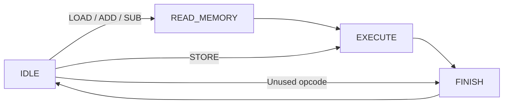
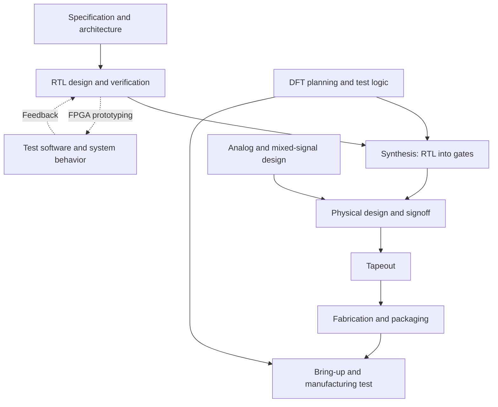
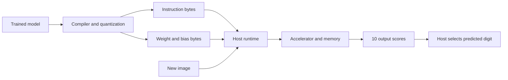

# Silicon Badgers onboarding

Welcome! Silicon Badgers is a student organization where we learn chip design by building real hardware together. This onboarding gives you the background to understand what we're making and start contributing.

Our first Tiny Tapeout project is aimed at MNIST handwritten-digit inference. Over the next 1–2 semesters, we plan to build a larger FPGA prototype for AI inference, including LLMs, with the longer-term goal of an ASIC. Here, you'll learn how the model, compiler, instructions, and hardware fit together.

We assume you already know binary, logic gates, registers, state machines, and basic Python. There are **no Python assignments** in this onboarding.

## Start here

| Your background | What to do | Estimated time |
| --- | --- | --- |
| Haven't completed ECE 551 | Work through all sections, including HDLBits, the calculator, and your own small testbench. | 6–8 hours |
| Completed ECE 551 | Read this introduction, then [the ISA refresher](#5-isa-refresher), then [chip design jobs](#9-chip-design-jobs-and-the-asic-flow) through submission. Skip the HDLBits and coding exercises; optionally revisit them. | 2–3 hours |

Spread this over about a week. These are estimates, not a speed test. Submit the Google Form **at the end**, after finishing your path.

**Stuck? Message Simon Richter, our Onboarding Chair, on Slack.** Include what you tried and a screenshot or error message when useful.

This onboarding is really important to the club, and we've put a ton of effort into making it useful. Please tell us how we can improve it, whether that's one confusing sentence or feedback about the whole thing. There's a required feedback section in the final form.

### Using AI

We strongly recommend using AI to explain things when you're confused. It's extremely useful for learning SystemVerilog and understanding the AI concepts in this onboarding. Ask follow-up questions, request simpler examples, and keep going until things make sense.

For the coding exercises, try to use minimal AI and write most of the code yourself. Having AI write everything might get you through onboarding, but you'll struggle when we start building the actual project. We can't control how you use it, but if you want to be an active member, contribute to the club, and eventually join leadership, it's to your advantage to understand what you're building and why it works.

### Contents

1. [What is a chip?](#1-what-is-a-chip)
2. [Download and set up](#2-download-and-set-up)
3. [Learn enough Verilog](#3-learn-enough-verilog)
4. [Verilog to SystemVerilog](#4-verilog-to-systemverilog)
5. [ISA refresher](#5-isa-refresher)
6. [Build the calculator](#6-build-the-calculator)
7. [Run QuestaSim/ModelSim](#7-run-questasimmodelsim)
8. [Write your own testbench](#8-write-your-own-testbench)
9. [Chip design jobs and the ASIC flow](#9-chip-design-jobs-and-the-asic-flow)
10. [FPGA or ASIC?](#10-fpga-or-asic)
11. [From pixels to a prediction](#11-from-pixels-to-a-prediction)
12. [From a model to hardware](#12-from-a-model-to-hardware)
13. [Submit and give feedback](#13-submit-and-give-feedback)

## 1. What is a chip?

*Beginner path.*

An **integrated circuit (IC)**, or chip, is a small piece of semiconductor containing transistors and connections that form a circuit. Think of all the gates and registers in a digital design physically connected on silicon. The silicon piece is the **die**; the package protects it and connects it to the circuit board.

An **ASIC**, or application-specific integrated circuit, is a chip designed for a particular application. For example, a video encoder chip has hardware built for encoding video. Its physical circuitry is fixed when it's manufactured.

An **FPGA**, or field-programmable gate array, is a manufactured chip containing configurable logic, registers, routing, and often memory and arithmetic blocks. You load a configuration that connects those resources into your circuit. Today it could be our calculator; tomorrow you can reconfigure it into a different design.

**SystemVerilog describes hardware.** Two `always_ff` blocks describe registers that operate at the same time. Writing the second block below the first does not mean the hardware waits for the first block to finish.

## 2. Download and set up

*Beginner path. Use VS Code to edit files and QuestaSim/ModelSim to simulate them.*

### Get the project from GitHub

1. Create a folder named `SiliconBadgers` somewhere you can find it, such as Documents.
2. Inside it, create a folder named `onboarding_project`.
3. Open [github.com/SiliconBadgers/onboarding](https://github.com/SiliconBadgers/onboarding).
4. Click the green **Code** button, then **Download ZIP**.
5. Find the downloaded ZIP in Downloads. Right-click it and select **Extract All**.
6. Open the extracted folder, usually `onboarding-main`. Copy **its contents** into your `SiliconBadgers/onboarding_project` folder.
7. Check that `README.md`, `rtl`, and `tb` are directly inside `onboarding_project`. Don't work inside the ZIP.

```text
SiliconBadgers/
└── onboarding_project/
    ├── README.md
    ├── rtl/
    │   ├── calculator.sv           You complete this
    │   └── data_memory.sv          Provided; leave it alone
    └── tb/
        ├── calculator_tb.sv        Provided checks; leave them alone
        └── student_testbench.sv    You complete this later
```

### Get VS Code and SystemVerilog support

1. [Download Visual Studio Code](https://code.visualstudio.com/download) for your computer and run the installer. On Windows, choose **User Installer**. If it is already installed on a lab computer, just open it.
2. Open VS Code. Click the **Extensions** icon on the left, or press **Ctrl+Shift+X** on Windows.
3. Search for `eirikpre.systemverilog` and install [SystemVerilog – Language Support](https://marketplace.visualstudio.com/items?itemName=eirikpre.systemverilog).
4. Select **File → Open Folder** and open `SiliconBadgers/onboarding_project`.
5. Open `rtl/calculator.sv`. Its language mode at the bottom right should say **SystemVerilog**.
6. Save edits with **Ctrl+S** before compiling. You can preview this README using **Ctrl+Shift+V**.

SystemVerilog is the language; the extension provides editor support such as syntax coloring. Installing it doesn't install a simulator. You'll check your circuit in QuestaSim/ModelSim.

### Open QuestaSim/ModelSim

QuestaSim is an upgraded version of ModelSim with more advanced features, but **for this project they function the same**. On your personal Windows computer you'll use ModelSim; on a CAE computer lab computer you'll use QuestaSim. We call it **QuestaSim/ModelSim** throughout this guide.

**Personal Windows computer**

Use an existing ModelSim installation, or get the Windows installer from the [official ModelSim FPGA 20.1.1 download page](https://www.altera.com/downloads/simulation-tools/modelsim-fpgas-standard-edition-software-version-20-1-1). Download `ModelSimSetup-20.1.1.720-windows.exe`, run it, and select **ModelSim FPGA Starter Edition** when prompted to choose an edition. The vendor download may require an account. This is a legacy release; if installation doesn't work on your device, use the CAE route below and ask Simon for help.

**CAE computer lab**

1. Open the **AppsAnywhere launcher/portal**.
2. Find and open **Quartus** through AppsAnywhere. The first launch can take a few minutes.
3. After Quartus opens, click the Windows button at the bottom left. Search for **QuestaSim** and open it.
4. Once QuestaSim opens, you can close Quartus.

If AppsAnywhere hasn't opened automatically, look for the **AppsAnywhere Portal** desktop shortcut. [CAE's AppsAnywhere guide](https://kb.wisc.edu/cae/153617) has more help. If you're using a Mac or Linux personal computer, use a CAE lab computer for this simulation exercise.

### Create a project

1. When QuestaSim/ModelSim opens, use the **new project** option in the startup popup if one appears. Otherwise select **File → New → Project**.
2. Name the project `onboarding_project`.
3. Set **Project Location** to your `SiliconBadgers/onboarding_project` folder. Keep the default library name `work`.
4. Select **Add Existing File** (or **Add File**, depending on the version).
5. Add all four SystemVerilog files: the two `.sv` files in `rtl` and the two in `tb`. Use **Browse** again to select files from the other folder.
6. Keep their existing locations. You don't need to copy them into another folder. Don't add the README or the downloaded ZIP as source files.
7. Close the Add Items window. You should see the four files in the Project tab.

Keep this project for later. First, get comfortable with the HDL syntax below.

## 3. Learn enough Verilog

*Beginner path. About two hours; it's fine if the FSMs take longer.*

HDLBits runs in your browser and checks your design against a reference. Complete **only the exercises listed here**, in this order. You don't need to work through the entire website.

| # | Exercise | What you're practicing |
| --- | --- | --- |
| 1 | [Getting Started](https://hdlbits.01xz.net/wiki/Step_one) | Submit a circuit and read the result |
| 2 | [Vectors](https://hdlbits.01xz.net/wiki/Vector0) | Represent several bits together |
| 3 | [Vectors in more detail](https://hdlbits.01xz.net/wiki/Vector1) | Select portions of a bus |
| 4 | [Modules](https://hdlbits.01xz.net/wiki/Module) | Connect a provided circuit by named ports |
| 5 | [2-to-1 multiplexer](https://hdlbits.01xz.net/wiki/Mux2to1) | Choose between two inputs |
| 6 | [Always blocks: combinational](https://hdlbits.01xz.net/wiki/Alwaysblock1) | Describe logic that responds to inputs |
| 7 | [Always blocks: clocked](https://hdlbits.01xz.net/wiki/Alwaysblock2) | Store a result on the clock edge |
| 8 | [Case statement](https://hdlbits.01xz.net/wiki/Always_case) | Select an action from several possibilities |
| 9 | [Avoiding latches](https://hdlbits.01xz.net/wiki/Always_nolatches) | Assign outputs on every combinational path |
| 10 | [DFF with synchronous reset](https://hdlbits.01xz.net/wiki/Dff8r) | Store eight bits and reset them |
| 11 | [Four-bit binary counter](https://hdlbits.01xz.net/wiki/Count15) | Update a register using its previous value |
| 12 | [Simple state transitions 3](https://hdlbits.01xz.net/wiki/Fsm3comb) | Turn a state table into combinational logic |
| 13 | [Simple FSM 2: synchronous reset](https://hdlbits.01xz.net/wiki/Fsm2s) | Connect next-state logic to a state register |
| 14 | [Simple FSM 3: synchronous reset](https://hdlbits.01xz.net/wiki/Fsm3s) | Implement a complete four-state controller |

For each exercise, read the explanation, fill in the module, click **Simulate**, and look for **Success!**. Keep the specified `top_module` name and ports. A compile error means your code couldn't be processed; a mismatch means the circuit ran but produced a wrong result.

Some HDLBits FSM templates include `parameter` declarations that give names to state numbers. You can leave that supplied scaffolding in place. Our calculator uses an `enum` for states and direct opcode values, so you won't need to write parameters or local parameters.

Before moving on, be able to explain why the counter remembers its value and why the multiplexer doesn't need a clock.

## 4. Verilog to SystemVerilog

*Beginner path. Same circuit ideas, a few clearer keywords.*

| In Verilog | In this SystemVerilog project | Meaning |
| --- | --- | --- |
| `wire` / `reg` in these simple, single-driver examples | `logic` | Declare a signal; how you assign it determines the hardware |
| `always @(*)` | `always_comb` | Combinational logic |
| `always @(posedge clk)` | `always_ff @(posedge clk)` | Registers updated on a rising clock edge |
| `=` in combinational blocks | Still `=` | Compute a combinational value |
| `<=` in clocked blocks | Still `<=` | Schedule a register update |
| `.v` file | `.sv` file | Tell the tools to use SystemVerilog |

`logic` doesn't automatically mean a register, and Verilog's `reg` doesn't automatically mean a physical register either. The assignment describes whether the signal is stored. Wires still have uses in SystemVerilog; this project just doesn't need the more complicated cases.

### A live answer versus a saved answer

```systemverilog
logic [7:0] a, b;
logic [7:0] live_sum, saved_sum;

always_comb begin
    live_sum = a + b;
end

always_ff @(posedge clk) begin
    if (reset) begin
        saved_sum <= 8'd0;
    end
    else begin
        saved_sum <= live_sum;
    end
end
```

If `a = 8` and `b = 3`, `live_sum` becomes 11 as the combinational logic settles. `saved_sum` keeps its old value until the next rising clock edge, then captures 11. If `b` changes to 4 between edges, `live_sum` becomes 12 but `saved_sum` still holds 11.

Think of `always_comb` as a live calculator display and `always_ff` as taking a photo of that display on each clock tick. Real gates have propagation delay; “live” means no clocked storage was added.

### Two habits that prevent lots of bugs

In `always_comb`, assign every output on every possible path. For example:

```systemverilog
always_comb begin
    result = 8'd0;
    if (enable) begin
        result = a + b;
    end
end
```

When `enable` is zero, the result is explicitly zero. Without that default, you'd be asking it to remember an old result, which implies a latch.

In `always_ff`, leaving a register unassigned in a branch means **keep its value**. That's useful for the accumulator while the calculator is idle. Use `<=` here: in `a <= b; b <= a;`, both assignments read the old values, so the registers swap on the edge.

A literal like `8'd11` means “eight bits, decimal 11.” `8'h11` means “eight bits, hexadecimal 11,” which is decimal 17. `8'sd11` is signed decimal 11; write negative five as `-8'sd5`. The calculator uses signed 8-bit data, so its range is −128 through 127. Overflow wraps: 127 + 1 becomes −128.

## 5. ISA refresher

*Everyone reads this section.*

An **instruction set architecture (ISA)** is the agreement about which instructions hardware understands and what each instruction does. The bits don't do anything by themselves: a decoder recognizes them, and control logic tells registers, arithmetic, and memory what to do.

Our calculator understands four operations and has one working register, the **accumulator**. Its data memory has 16 locations, each holding one signed byte.

| Instruction | Opcode bits | Action |
| --- | --- | --- |
| `LOAD address` | `0000` | `memory[address] → accumulator` |
| `ADD address` | `0001` | `accumulator + memory[address] → accumulator` |
| `SUB address` | `0010` | `accumulator − memory[address] → accumulator` |
| `STORE address` | `0011` | `accumulator → memory[address]` |

Each instruction is **one byte**:

```text
       bits 7 6 5 4       bits 3 2 1 0
      ┌────────────┬──────────────────┐
      │   opcode   │  memory address  │
      └────────────┴──────────────────┘
```

Four address bits select locations 0–15. The high four bits allow 16 possible opcodes, but we define only four. For this calculator, other opcodes finish without changing the accumulator or memory.

Given `memory[0] = 8` and `memory[1] = 3`:

| Assembly | Bits | SystemVerilog literal | Result |
| --- | --- | --- | --- |
| `LOAD 0` | `0000_0000` | `8'h00` | Accumulator becomes 8 |
| `ADD 1` | `0001_0001` | `8'h11` | Accumulator becomes 11 |
| `STORE 2` | `0011_0010` | `8'h32` | Memory location 2 becomes 11 |

Notice that `8'h11` is an encoded instruction, not the arithmetic result 11.

### How the RTL implements it

The provided decoder splits `instruction[7:4]` from `instruction[3:0]`. When a command is accepted, registers save those fields so later input changes can't change the command being executed.

The controller selects an action based on the saved opcode. For example, `0001` selects addition and enables an accumulator update; `0011` enables a memory write instead. You can think of the path as:

```text
instruction byte → decode opcode/address → controller
                 → select arithmetic or memory action → register/memory update
```

The **datapath** is the arithmetic and storage that operates on the numbers. The **controller** decides when each part acts. An ISA describes what an instruction means; this state machine is one implementation of it. Another implementation could take a different number of cycles and still produce the same results.

This calculator gets commands from the testbench. It doesn't fetch a program from instruction memory, and you don't need a program counter or branching.

### Try it

Before looking at any code, write down:

1. The hexadecimal byte for `SUB 1`.
2. The command represented by `8'h34`.
3. Three instruction bytes that compute `memory[1] − memory[0]` and store it at address 4.

Keep your answers nearby. You'll see the same ideas in the accelerator section.

**Completed ECE 551? Continue to [chip design jobs and the ASIC flow](#9-chip-design-jobs-and-the-asic-flow).** You can skip the calculator implementation and both testbenches.

## 6. Build the calculator

*Beginner path. Edit only `rtl/calculator.sv` for this part.*

Your job is to finish the calculator's state transitions, memory-read register, and accumulator updates. The memory and instruction interface are already provided. The starting code is valid SystemVerilog, but it is intentionally incomplete; it will not pass the testbench yet.

### The provided memory

`rtl/data_memory.sv` contains 16 signed 8-bit locations. It starts with 8 at address 0, 3 at address 1, and zero everywhere else.

Reading is combinational: set `memory_address`, and the selected value appears on `memory_read_data`. Writing happens on a rising clock edge when `memory_write_enable` is 1; the memory copies `memory_write_data` into the selected address.

The `initial` block preloads this teaching memory for simulation. ASIC memories need a real initialization/loading plan; don't assume this preload creates an automatically initialized fabricated memory. Reset clears the calculator, not the memory. Restarting the simulation reloads the initial memory contents.

### Understand the signals

| Signal | Meaning |
| --- | --- |
| `instruction[7:0]` | Encoded command and address |
| `command_valid` | Testbench is presenting a command |
| `command_ready` | Calculator can accept a command |
| `command_done` | Current command has finished |
| `accumulator` | Stored working number |
| `memory_address` | Selected location, 0–15 |
| `memory_read_data` | Data from that location |
| `memory_write_data` | Data to write to that location |
| `memory_write_enable` | Allow a write on the next rising edge |

A command is accepted **on a rising edge when both `command_valid` and `command_ready` are 1**. While the calculator is busy, ready is 0. Keep the instruction stable until acceptance, then lower valid so it isn't accepted again later.

The provided interface handles the ready/done signals and saves the opcode and address. Read those blocks, but keep your changes in the TODOs.

### The four states



| State | What happens before the next rising edge | What happens on that edge |
| --- | --- | --- |
| `IDLE` | Advertise ready and examine the incoming command | Save the accepted opcode/address and leave idle |
| `READ_MEMORY` | Memory is showing the saved address's data | Capture it into `saved_memory_data` |
| `EXECUTE` | Select the saved opcode's operation | Update the accumulator, or let memory perform STORE |
| `FINISH` | Advertise done for one cycle | Return to idle |

For `LOAD 0`, edge 1 accepts the instruction, edge 2 captures the number 8, and edge 3 copies 8 into the accumulator. Done is high after edge 3; edge 4 returns the calculator to idle. `STORE` skips the read, so its write happens at edge 2 instead.

### Finish the TODOs

1. **State transitions.** Use the diagram to finish the `case` statement in the first `always_comb`. Stay idle without a command. Reading operations go to `READ_MEMORY`; STORE goes straight to `EXECUTE`; unused opcodes go to `FINISH`.
2. **Capture the memory value.** In the clocked block, when the current state is `READ_MEMORY`, save `memory_read_data` into `saved_memory_data`. This is a register update, so use `<=`.
3. **Accumulator operations.** In `EXECUTE`, use the saved opcode. LOAD copies the saved memory value, ADD adds it to the accumulator, and SUB subtracts it. STORE keeps the accumulator unchanged; the provided memory-write logic handles the write.

Start by implementing LOAD and following it through the waveform. Then add ADD and SUB. Finally check that STORE and the return to idle work. The full provided test needs all four operations, so intermediate failures are expected.

Leave the reset, module ports, and supplied interface logic in place. Don't add parameters, local parameters, helper functions, or tasks. The provided `enum` just gives readable names to the four states.

## 7. Run QuestaSim/ModelSim

*Beginner path. Use your saved QuestaSim/ModelSim project from section 2.*

### Compile and read errors

1. Save your code in VS Code.
2. In QuestaSim/ModelSim, click **Compile** at the top, then **Compile All**.
3. Read the **Transcript** at the bottom. If something is wrong, the error appears in red.
4. Double-click the red error text to open the message details or jump to the file and line. If your version only shows details, use the filename and line number in that message to find it in VS Code.
5. Fix the first error, save, then **Compile → Compile All** again.

Common mistakes: missing semicolons, unmatched `begin`/`end`, misspelled signal names, and compiling a `.sv` file as plain Verilog. If the language is wrong, check the file's properties in the Project tab and select SystemVerilog.

Compiling with no errors only proves the tools can process your code. The testbench checks whether your circuit behaves correctly.

### Start the provided testbench

1. Click the **Library** tab.
2. Expand **work**.
3. Find **calculator_tb**, right-click it, and select **Simulate**.

You can also use **Simulate → Start Simulation** at the top, expand **work**, and select the testbench. If that route causes issues in your installation, use the Library/right-click method above.

Select `calculator_tb`, not `calculator` or `student_testbench` for this first test. The testbench creates the clock, sends the commands, and checks the results.

### Add waves before running

1. In the **Sim** pane, select the top-level `calculator_tb` instance. Its signals appear in **Objects**. If the pane is hidden, find it under **View**.
2. Select `clk`, `reset`, `instruction`, `command_valid`, `command_ready`, `command_done`, `accumulator`, `memory_address`, `memory_read_data`, `memory_write_data`, and `memory_write_enable`. Use Ctrl-click for several signals.
3. Right-click the selection and choose **Add Wave → Selected Signals** (some versions label this **Add to Wave**). The signals should appear in the **Wave** window.
4. Expand `calculator_tb` in the Sim pane and select `dut`. Add `current_state` from Objects too.
5. In Wave, right-click `instruction` and choose **Radix → Hexadecimal**. Set the accumulator and memory data signals to **Decimal/signed decimal**, so negative results show as negative numbers. Keep address unsigned.
6. In the Transcript, enter `onfinish stop`. This keeps the simulation available for waveform inspection when the testbench finishes.
7. Click **Run All**, or type `run -all` in the Transcript and press Enter.
8. Click inside the **Wave** window, then press the **Zoom Full magnifying-glass button**. Hover over the magnifying-glass icons until the tooltip says **Zoom Full**; a plain Zoom In button won't fit the whole run. You can also type `wave zoom full`.

If a signal is missing because it was optimized away, enter `quit -sim`, then `vsim -voptargs=+acc work.calculator_tb`, and add the signals again before running.

The provided test includes these calculations:

```text
LOAD 0 → ADD 1 → STORE 2       memory[2] should become 11
LOAD 0 → SUB 1 → STORE 3       memory[3] should become 5
```

A completed calculator should print **ALL TESTS PASSED**. A timeout usually means the state machine never returned the expected ready/done signal. The untouched starter is expected to time out; it must not print a pass.

### Read the waveform

Find a rising edge where valid and ready are both high. That is instruction acceptance. Follow the state changes and check that:

- LOAD changes the accumulator to 8.
- ADD changes it to 11; the change happens on a clock edge.
- STORE raises `memory_write_enable`, and the accumulator stays at 11.
- Done stays high for one cycle, then ready returns.
- The second calculation leaves the accumulator at 5.

Take a screenshot of **ALL TESTS PASSED**. You'll capture the waveform submission from your own testbench in the next section.

After changing RTL, end the loaded simulation with **Simulate → End Simulation** or `quit -sim`, compile all again, and load the testbench again. If only replaying the same compiled code, use `restart -f` followed by `run -all`. If waves were added after running, restart and rerun to capture the history.

## 8. Write your own testbench

*Beginner path. Complete `tb/student_testbench.sv` after the supplied test passes.*

A testbench is the simulation environment around the hardware. It provides inputs and checks outputs. Its `#5` delays and `$display` messages are simulation instructions; they don't become gates in the calculator.

The scaffold provides signal declarations, module connections, and a clock. You write the reset sequence, commands, and result check. Your test should calculate **3 − 8 = −5** and store it at address 4.

1. Initialize reset, instruction, and valid so inputs don't start unknown. Keep reset high across at least two rising edges, then lower it on a falling edge.
2. Send `LOAD 1`, wait for completion, then send `SUB 0`, and finally `STORE 4`.
3. Follow the command handshake: on a falling edge when ready is high, present the instruction byte and valid. On the next falling edge, lower valid: the intervening rising edge accepted the command. Wait for done before the next instruction.
4. Check `memory.memory[4]` against `-8'sd5`. This name means “the array named memory inside the instance named memory.”
5. Print **STUDENT TEST PASSED** only if the result is right. Otherwise use `$fatal(1, "Unexpected result");`. End a successful test with `$finish;`.

Look at the provided testbench to understand the timing. In simulation, `@(negedge clk);` waits for a falling edge and `@(posedge clk);` waits for a rising edge. Our hardware updates on rising edges, so driving and checking on falling edges avoids competing with those updates. Recheck ready on a falling edge before each command, even after seeing done.

Use `!==` for the result check so an unknown `X` also counts as wrong. The scaffold has a timeout so a missing clock/reset/command doesn't leave the simulation running forever.

Compile all, end any previous simulation, then use **Library → work → student_testbench → right-click → Simulate**. Add its signals, run all, and press Zoom Full as before. A fresh simulation reloads the provided memory. Take your waveform screenshot here: show clock, reset, instruction, accumulator, command_valid, command_ready, and command_done, with readable signal names, values, and time axis.

You will submit both your completed `calculator.sv` and `student_testbench.sv`. Keep `calculator_tb.sv` unchanged so its checks remain useful.

## 9. Chip design jobs and the ASIC flow

*Everyone continues here.*

Follow one example: a company wants a chip that classifies camera images within a power and latency budget. Many people work on it at once; the arrows below show the main handoffs, not a strict sequence where one team waits for every other team.



### Who does what?

| Stage / role | What they do for our image-classifier example | Names you might see |
| --- | --- | --- |
| **Architecture** | Decide the supported operations, number of multipliers, memory sizes, data widths, and performance targets. “Can we process an image fast enough with four multipliers?” | Chip architect, hardware architect, microarchitect, system architect |
| **RTL design** | Turn those decisions into SystemVerilog: arithmetic, buffers, controllers, and interfaces. Your calculator is a tiny example of this work. | RTL design engineer, digital design engineer, ASIC design engineer, logic design engineer |
| **Design verification** | Try to break the RTL before fabrication. Build testbenches/reference models and check reset, overflow, memory traffic, and combinations of events. | DV engineer, design verification engineer, functional verification engineer |
| **Physical design** | Turn the gate-level design into a physical layout and make it meet timing, power, area, and manufacturing rules. | Physical design engineer, physical implementation engineer, backend engineer, place-and-route engineer |
| **DFT: design for test** | Add ways to test the manufactured chip for defects. Scan chains make internal registers controllable/observable; memory tests look for faulty storage. | DFT engineer, design-for-test engineer, testability engineer |
| **Analog / mixed-signal** | Design circuits that handle continuous voltages or connect analog and digital worlds, such as ADCs, clock PLLs, and high-speed I/O. | Analog IC designer, mixed-signal design engineer, AMS engineer |

An ADC could turn a sensor voltage into a digital pixel value; the digital inference engine then processes those values. Analog blocks use transistor-level design and simulation, so they don't follow exactly the same RTL-to-gates path.

A chip project may have a few architects, a larger RTL team, and a verification team as large as or larger than the RTL team. The balance depends on the company and product; there isn't one fixed staffing ratio. Job titles overlap too, so read the job description.

Software engineers also matter: they develop compilers, drivers, runtimes, firmware, and applications. For our accelerator, someone has to translate the trained model into commands and get data to the hardware.

### What happens between RTL and a working chip?

1. **Specification and verification plan:** agree on behavior and how to test it. For example, does an overflowing sum wrap or saturate?
2. **RTL and functional verification:** build the design and compare it against expected behavior. A testbench passing one image doesn't prove every possible case.
3. **Synthesis:** translate RTL into gates and registers from a technology library. An addition becomes actual adder circuitry. DFT logic is integrated into the implementation flow, with planning starting earlier.
4. **Physical design:** floorplan the blocks, place cells, build the clock distribution network, and route wires. A long wire can make a previously reasonable operation too slow.
5. **Signoff:** check timing, power-related limits, and layout correctness. **STA** checks whether signals reach registers in time. **DRC** checks manufacturing geometry rules; **LVS** checks that the layout implements the intended circuit connections.
6. **Tapeout and fabrication:** deliver the final layout data to the foundry, which makes the silicon. “Tapeout” is the design handoff, not the moment a working chip arrives.
7. **Packaging, bring-up, and test:** connect the die to its package and board, power it up, and test it. Bring-up checks the real chip/system; manufacturing test screens individual chips for defects using features such as DFT.

DV asks, “Did we design the right behavior?” Manufacturing test asks, “Was this particular chip built without defects?” Both are necessary.

Before fabrication, teams may map digital RTL onto an FPGA to test software and system behavior. This is **hardware prototyping**: the logic runs on real FPGA resources. QuestaSim/ModelSim is **software simulation**. An FPGA prototype can expose system bugs, but doesn't prove ASIC timing, analog behavior, or physical layout is correct.

Further reading: [ASIC design](https://www.synopsys.com/glossary/what-is-asic-design.html), [physical design](https://www.synopsys.com/glossary/what-is-physical-design.html), and [DFT](https://www.synopsys.com/glossary/what-is-design-for-test.html).

## 10. FPGA or ASIC?

An FPGA is configurable hardware you buy and reprogram. An ASIC is custom circuitry you design and have manufactured. Both are real chips.

| | FPGA | ASIC |
| --- | --- | --- |
| Changing the design | Load a new configuration | Physical circuit changes usually require another tapeout |
| Upfront cost and schedule | Buy a board/device; start testing quickly | Pay for design, verification, tools/IP, masks, fabrication, packaging, and testing |
| Power, speed, and area | General configurable resources add overhead | A well-designed implementation can be more efficient for the target task |
| Unit cost | Often attractive at low volume | High upfront cost can be spread over many units |
| Common uses | Prototypes, changing telecom systems, industrial controls, aerospace, custom instruments, low-latency trading | Phone SoCs, networking switches, video codecs, storage controllers, high-volume inference chips |

There is overlap: an industry can use both. A telecom company might choose an FPGA for an evolving protocol and an ASIC for a high-volume product with stable requirements.

**Tapeout can be extremely expensive**, particularly for a large chip on a modern process. Finding a hardware bug afterward can mean redesigning, waiting for fabrication again, and paying again. Tiny Tapeout makes small shared-chip projects much more accessible by sharing manufacturing costs; it isn't the cost model of a large standalone ASIC.

For the club, an FPGA lets us fix bugs and experiment repeatedly before committing to a physical design. Our MNIST Tiny Tapeout project is the initial target; the larger AI accelerator is a later FPGA prototype, with an eventual ASIC as the longer-term plan. This onboarding explains the pieces using one concrete example rather than fixing the final chip's area, memory placement, or interface.

## 11. From pixels to a prediction

*Everyone. Work through the numbers; no Python installation or coding is needed.*

### Start with a 3×3 image

Imagine a black-and-white image stored as grayscale values: 0 is black, 255 is white. One pixel fits in an unsigned byte. Eight bits have **2⁸ = 256 possible values**, including both endpoints 0 and 255.

```text
Vertical line         Horizontal line       Our chosen weights
  0  255    0            0    0    0          -1    2   -1
  0  255    0          255  255  255          -1    2   -1
  0  255    0            0    0    0          -1    2   -1
```

Multiply each pixel by the weight in the same position, then add the nine products.

- **Vertical:** only the three middle-column pixels contribute: `255×2 + 255×2 + 255×2 = 1530`.
- **Horizontal:** only the middle row contributes: `255×(−1) + 255×2 + 255×(−1) = 0`.

The middle column is rewarded; bright pixels at the sides are penalized. This particular detector gives a positive result for our vertical image and zero for our horizontal image.

A **neuron** takes inputs, computes a weighted sum, adds a **bias**, and may apply an **activation function**:

```text
neuron output = activation(sum of input × weight + bias)
```

The bias shifts the result even when the inputs stay the same. With bias −255, the vertical score becomes 1275 and the horizontal score becomes −255. **ReLU** replaces negative values with zero, so those outputs become 1275 and 0.

We chose these weights ourselves to make the math visible. A trained network learns weights and biases from examples; individual hidden neurons aren't guaranteed to be clean “line detectors.” This example uses one weighted sum over the whole 3×3 image, not a sliding convolution.

### Training versus inference

During **training**, software predicts answers on labeled examples, measures error, and updates weights and biases to improve the predictions. The network structure—such as how many neurons it has—is chosen by the designer.

During **inference**, a new image passes through the network using the learned weights and biases. Those parameters stay fixed while processing the image. Our accelerator is for inference; it doesn't train the network.

### Scale up to MNIST

MNIST contains 28×28 grayscale images of handwritten digits, with labels 0–9. We'll use this model as our worked example:

```text
28×28 image → 784 inputs → Linear(784, 128) → ReLU → Linear(128, 10) → prediction
```

Flattening means listing pixels row by row. Pixel at row `r`, column `c` goes at index `r×28+c`. Row 0 occupies locations 0–27, row 1 occupies 28–55, and the last pixel is location 783. We changed the arrangement, not the number of values.

The first **layer** contains 128 neurons. Each neuron sees all 784 inputs, so it needs 784 weights and one bias. That gives **128×784 = 100,352 weights** and **128 biases**.

For neuron 0:

```text
s0 = x[0]×W1[0][0] + x[1]×W1[0][1] + ... + x[783]×W1[0][783] + b1[0]
h[0] = ReLU(s0)
```

Repeat that for neurons 1–127 to get 128 hidden activations. An **activation** is a value produced or passed through the network; a **weight** is a learned coefficient. The hidden activations depend on the current image.

The second layer has 10 neurons, each consuming those 128 hidden activations. It needs **10×128 = 1,280 weights** and **10 biases**. Its outputs are **logits**, or unnormalized class scores. For example:

```text
digit:   0   1   2   3   4   5   6    7   8   9
score:  -4   2   0  -1   3  -2   1   12   5   0
```

The largest score is at index 7, so the prediction is “7.” Taking the index of the largest value is **argmax**. We don't need softmax probabilities just to choose the largest score.

PyTorch is a software framework for defining and training models. Its `Linear(784, 128)` operation performs those 128 weighted sums and biases. A trained model includes the operation structure and learned parameter values—not a precomputed answer for every image. See [PyTorch Linear](https://docs.pytorch.org/docs/2.9/generated/torch.nn.Linear.html) and [MNIST](https://docs.pytorch.org/vision/stable/generated/torchvision.datasets.MNIST.html).

### Quantization: fitting numbers into bytes

Training often uses floating-point values such as 0.25. For our teaching hardware example, activations and weights use **INT8**, signed eight-bit integers, while sums and biases use **INT32**, signed 32-bit integers.

Raw image bytes are **unsigned 0–255**. Signed INT8 is **−128–127**. They occupy the same number of bits but interpret those bits differently: putting raw 255 straight into a signed byte would read as −1.

We therefore convert the image deliberately. In this example:

```text
normalized pixel = raw_pixel / 255
input INT8 value = round(normalized pixel × 127)

raw 0   → 0
raw 128 → 64
raw 255 → 127
```

Each converted activation still occupies one byte. This simple scaling uses signed storage even though these particular inputs are nonnegative.

For weights, a **scale** says how much one integer step represents. If the weight scale is 0.125, weight 0.25 becomes integer 2, and −0.375 becomes −3:

```text
integer = round(real value / scale), clamped to the allowed integer range
approximate real value = integer × scale
```

This example uses zero-point 0. Other quantization schemes also use a zero-point offset; the compiler and hardware must agree on the convention. Quantization trades some precision for smaller storage and simpler arithmetic.

Products and sums need more bits. Even one `127×127` product is 16,129, and a neuron adds hundreds of products. Accumulate into 32 bits; don't squeeze each partial sum back into an 8-bit register. Biases must use the same units as that sum: with zero-point 0, their scale is **input scale × weight scale**.

After a hidden layer, apply ReLU and **requantize** the wide result back to the next layer's INT8 scale, including saturation to the allowed range. This isn't just taking the bottom eight bits. Our example uses one weight scale per layer, so the ten final INT32 scores share a scale and can be compared directly. With different scales per output neuron, convert the scores to common units before comparing them. [More on integer quantization](https://developers.google.com/edge/litert/conversion/tensorflow/quantization/quantization_spec).

For one tiny worked sum, pretend only the first three inputs have nonzero contributions:

```text
input integers:       0, 127, 64
weight integers:     -1,   2, -1
bias integer:         5

accumulator: 0 → 0 → 254 → 190 → 195 after bias
ReLU: 195
example output rescaling by 1/8: floor(195/8) = 24
stored hidden activation: 24
```

For this example the output scale is eight times the product scale, so a right shift by 3 implements the division. Actual layer scaling is chosen from the trained model; rounding and scaling rules must match in software and RTL. An output above 127 would clamp to 127 in this signed INT8 example.

## 12. From a model to hardware

*Everyone. Keep the same 784 → 128 → 10 example in mind.*



### Give every value a home

For this example, **a byte address identifies one byte**, and model data is stored in contiguous memory regions. A “weight matrix” is a useful logical shape; it can be laid out as a flat sequence of bytes.

| Region | Shape / type | Data size | What it holds |
| --- | --- | --- | --- |
| Input activations | 784 × INT8 | 784 bytes | Converted pixels for the current image |
| First-layer weights, W1 | 128 × 784 × INT8 | 100,352 bytes | One row of 784 weights per hidden neuron |
| First-layer biases, b1 | 128 × INT32 | 512 bytes | One wide bias per hidden neuron |
| Hidden activations | 128 × INT8 | 128 bytes | ReLU and requantized first-layer results |
| Second-layer weights, W2 | 10 × 128 × INT8 | 1,280 bytes | One row of 128 weights per output neuron |
| Second-layer biases, b2 | 10 × INT32 | 40 bytes | One wide bias per output neuron |
| Output scores | 10 × INT32 | 40 bytes | The ten digit scores |
| Accumulator scratch space | Up to 128 × INT32 in this example | 512 bytes | Wide partial/finished sums before requantization |
| Instruction region | Encoded commands | Depends on encoding/program length | Which operations to execute and where |

The raw image also takes 784 unsigned bytes on the host before conversion. It is not an extra 784 required on-chip registers.

Here is an **illustrative system-memory map**, chosen to make the addresses concrete:

| Region | Start byte address | Last byte address |
| --- | --- | --- |
| Reserved instruction space (1,024 bytes) | `0x00000` | `0x003FF` |
| Input activations | `0x01000` | `0x0130F` |
| W1 | `0x02000` | `0x1A7FF` |
| b1 | `0x1A800` | `0x1A9FF` |
| Hidden activations | `0x1AA00` | `0x1AA7F` |
| W2 | `0x1AB00` | `0x1AFFF` |
| b2 | `0x1B000` | `0x1B027` |
| Output scores | `0x1B100` | `0x1B127` |
| Accumulator scratch space | `0x1B200` | `0x1B3FF` |

For example, input pixel 1 lives at `0x01001`. With W1 stored row by row, `W1[j][i]` lives at `0x02000 + j×784 + i`. Bias `b1[j]` begins at `0x1A800 + j×4` because each bias takes four bytes.

These are separate **regions**, not necessarily separate physical memory chips. Much of the data may live in external memory and move through small on-chip buffers. We are not claiming all these bytes fit inside one Tiny Tapeout tile. The instruction reservation and addresses are teaching choices, not the final accelerator specification.

### What the compiler does

The compiler reads the model's operations and parameters, checks which operations our hardware supports, chooses numeric formats, and creates an executable plan.

For our example it recognizes “Linear → ReLU → Linear,” lays out W1/b1/W2/b2, converts parameters into integer bytes, and generates instructions to move data and run those operations. It might break a large matrix operation into smaller **tiles** that fit the chip's buffers.

An **assembler** turns instruction names and operands into the binary encoding that hardware decodes. The compiler decides which operations are needed; the assembler encodes them. These can be stages of the same software tool.

The compiler doesn't send Python source to the chip. It produces instruction bytes, parameter bytes, and metadata such as addresses, shapes, and scaling values. Supporting a particular PyTorch model requires supporting its operations; it doesn't automatically mean every PyTorch model will run.

### A bigger ISA for the accelerator

The onboarding calculator's byte-sized ISA only supports a 4-bit address and four scalar operations. It cannot encode this larger memory map or a whole matrix operation. An accelerator ISA needs wider or additional fields for addresses, buffer selection, dimensions, and scaling.

Use this **illustrative assembly** to understand the plan; it is not code to run in the calculator:

```text
LOAD     input_region → A_buffer
LOAD     W1_region    → W_buffer
LOAD     b1_region    → B_buffer
MATMUL   A_buffer, W_buffer → ACC
ADD_BIAS B_buffer → ACC
RELU     ACC → ACC
RESCALE  ACC → H_buffer
STORE    H_buffer → hidden_region

LOAD     hidden_region → A_buffer
LOAD     W2_region     → W_buffer
LOAD     b2_region     → B_buffer
MATMUL   A_buffer, W_buffer → ACC
ADD_BIAS B_buffer → ACC
STORE    ACC → output_region
HALT
```

`RESCALE` converts the wide results into INT8 values in a small hidden-output buffer, `H_buffer`; STORE writes those values to system memory. A real ISA could combine conversion with ReLU or STORE. Likewise, the large LOADs above represent logical transfers: a small implementation repeats transfers and computation in chunks. They do not move 100,352 weights in one clock.

The memory directions are:

```text
System / external memory ──LOAD──> on-chip A, W, and B buffers
A and W buffers ──multiply/add──> wide ACC registers or scratch space
B buffer ──add bias──> ACC
ACC ──ReLU + rescale──> H buffer ──STORE──> hidden activation region
ACC ──STORE──> output region in system / external memory
```

The calculator's LOAD copies one memory value into one accumulator. The accelerator example uses LOAD to move a block into a buffer. The shared idea is explicit data movement; their exact ISA definitions differ.

### What the runtime does

The **host** is the computer or controller connected to the accelerator. Its **runtime** is the software that loads compiled instructions and parameters, prepares each input image, starts execution, waits for completion, and reads the results.

Before execution, model parameters and instructions are loaded into their assigned regions. For each new image, the runtime writes new input activations. During execution, hardware reads the prepared instructions/data and writes intermediate values and scores. The runtime finally reads the ten scores and selects the largest.

For example, the weights are reused for a photo of a 7 and a photo of a 2. The input bytes, hidden activations, and output scores change. Training or loading a different model changes the weights.

### Follow one neuron through the chip

Suppose we're computing hidden neuron 0:

1. Clear its 32-bit accumulator.
2. Read input activation 0 and weight `W1[0][0]` into small local storage.
3. Multiply and add the product to the accumulator.
4. Repeat for inputs 1–783.
5. Add `b1[0]`.
6. Apply ReLU, rescale, and store the INT8 result at hidden location 0.

That repeated “multiply, then accumulate” is a **MAC** operation. The earlier numeric example—0, then 254, then 190, then bias producing 195—is the same process on three inputs.

Repeat for all 128 hidden neurons. Then compute the ten second-layer neurons using the hidden activations. A serial implementation reuses one multiplier for many cycles; a parallel implementation uses several multipliers to work on multiple products at once. More arithmetic helps only if memory can supply data fast enough.

The two layers need `128×784 + 10×128 = 101,632` multiplications per image, before counting bias, rescaling, or control work. That is an operation count—not a promise of a particular clock rate or latency.

### Verify the same example at every level

| Check | What runs | What should agree |
| --- | --- | --- |
| Floating-point model | Original trained software model | Baseline predictions/accuracy |
| Quantized reference | Integer arithmetic with specified rounding, saturation, and overflow | Accuracy is evaluated against the original model |
| ISA simulator | Software interpreting the compiled instructions | Exact integer intermediate/final values against the quantized reference |
| RTL simulation | SystemVerilog in QuestaSim/ModelSim | Values, instruction behavior, handshakes, reset, and timing |
| FPGA prototype | Actual configured hardware | Same test inputs give the expected outputs on the board |
| Fabricated ASIC | Manufactured circuitry | Bring-up checks the real device; manufacturing tests screen defects |

If software predicts 7 but RTL predicts 2, compare intermediate results. Did input location 1 contain the right pixel? Did the first multiply use the right weight? Was a signed byte interpreted as unsigned? A small reference example lets us locate the first disagreement.

### One small ISA exercise

Using the illustrative accelerator commands, write a short sequence that:

1. Loads an input vector and weights.
2. Computes a weighted sum.
3. Adds a bias.
4. Applies ReLU and rescales the result.
5. Stores the result.

Label which steps read memory, which perform arithmetic, and which write memory. Then explain why STORE before MATMUL would save the wrong value. This is a reading/writing exercise, not a Python assignment.

An LLM uses a more complicated model: token inputs, attention, multiple layers, and additional memory such as a KV cache for previous tokens. The same model → compiler → ISA → hardware relationship still applies. That's the connection to our later project; you don't need to learn an entire transformer architecture for onboarding.

## 13. Submit and give feedback

Only open the final Google Form after completing your path. **Get the submission link from Simon Richter on Slack**; it will be added here when the form is published.

The form asks for your **first and last name in one textbox**, your **UW email**, and which path you completed.

If you completed the beginner coding path, upload:

- A screenshot showing **ALL TESTS PASSED** from the provided testbench.
- A readable waveform screenshot from your own `student_testbench` after **Zoom Full**.
- Your completed `calculator.sv`.
- Your completed `student_testbench.sv`.

If you completed ECE 551 and skipped the coding path, skip those uploads. Everyone completes the shared **20-question quiz** and required feedback. Aim for **16/20 (80%)**; use the explanations to revisit anything you missed and retry as needed. Quiz passing and review of the required coding submissions are separate parts of completion.

Google Forms requires a Google sign-in for file uploads. Enter your UW email in the requested field even if you use a different Google account to upload. If that causes an access issue, message Simon. [Google's upload help](https://support.google.com/docs/answer/15473134?hl=en).

For feedback, tell us how useful onboarding was and what we should improve. Specific or general feedback is welcome. If you don't have a particular suggestion, say what felt clear and why instead of leaving it blank.

Before submitting, you should be able to explain what an instruction does, why verification happens before tapeout, and how the numbers in an image become a prediction on our accelerator.
