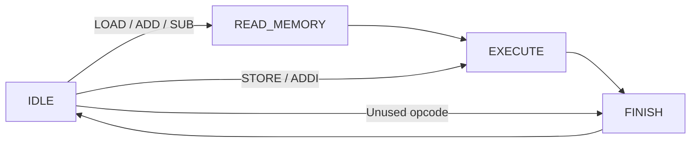

# Calculator project

> [!IMPORTANT]
> If you're viewing this in VS Code, press **Ctrl+Shift+V** to display this document correctly.

[Start here](../README.md) · Document 5 of 10

*Beginner path. Edit only `rtl/calculator.sv` for this part.*

Your job is to write two complete `always_comb` blocks—one for next-state logic and one for output-control logic—plus a complete register-update `always_ff` block. The module ports, state names, and internal signals are provided. The starting code is valid SystemVerilog, but it is intentionally incomplete and will not pass the testbench yet.

## The provided memory

`rtl/data_memory.sv` contains 16 signed 8-bit locations. It starts with 8 at address 0, 3 at address 1, and zero everywhere else.

Reading is combinational: set `memory_address`, and the selected value appears on `memory_read_data`. Writing happens on a rising clock edge when `memory_write_enable` is 1; the memory copies `memory_write_data` into the selected address.

The `initial` block preloads this teaching memory for simulation. ASIC memories need a real initialization/loading plan; don't assume this preload creates an automatically initialized fabricated memory. Reset clears the calculator, not the memory. Restarting the simulation reloads the initial memory contents.

## Understand the signals

| Signal | Meaning |
| --- | --- |
| `instruction[7:0]` | Encoded command and operand |
| `command_valid` | Testbench is presenting a command |
| `command_ready` | Calculator can accept a command |
| `command_done` | Current command has finished |
| `accumulator` | Stored working number |
| `memory_address` | Selected location, 0–15 |
| `memory_read_data` | Data from that location |
| `memory_write_data` | Data to write to that location |
| `memory_write_enable` | Allow a write on the next rising edge |

A command is accepted **on a rising edge when both `command_valid` and `command_ready` are 1**. While the calculator is busy, ready is 0. Keep the instruction stable until acceptance, then lower valid so it isn't accepted again later.

Your next-state block decides where the controller goes, your output-control block drives the interface from the current state, and your clocked block updates stored values. Giving every combinational output a default value is important: otherwise the hardware may need to remember an old value, creating a latch.

## The four states



| State | What happens before the next rising edge | What happens on that edge |
| --- | --- | --- |
| `IDLE` | Advertise ready and examine the incoming command | Save the accepted opcode/operand and leave idle |
| `READ_MEMORY` | Memory is showing the saved address's data | Capture it into `saved_memory_data` |
| `EXECUTE` | Select the saved opcode's operation | Update the accumulator, or let memory perform STORE |
| `FINISH` | Advertise done for one cycle | Return to idle |

For `LOAD 0`, edge 1 accepts the instruction, edge 2 captures the number 8, and edge 3 copies 8 into the accumulator. Done is high after edge 3; edge 4 returns the calculator to idle. STORE and ADDI skip the memory read, so they execute on edge 2 instead.

## Write the three blocks

### TODO 1: `always_comb`

Write the whole next-state block yourself. Give `next_state` a default value first, then use `case (current_state)` to implement the diagram. Stay in `IDLE` without a valid command. LOAD, ADD, and SUB go to `READ_MEMORY`; STORE and ADDI go directly to `EXECUTE`; unused opcodes go to `FINISH`. The other states advance in order and the `default` state recovers to `IDLE`.

### TODO 2: output-control `always_comb`

Write a second `always_comb` block that:

1. Defaults `command_ready`, `command_done`, and `memory_write_enable` to 0.
2. Always drives `memory_address` from `saved_operand` and `memory_write_data` from `accumulator`.
3. Keeps all three control outputs at 0 while reset is high.
4. When not resetting, raises `command_ready` in `IDLE`, raises `memory_write_enable` in `EXECUTE` only for STORE, and raises `command_done` in `FINISH`.

### TODO 3: `always_ff`

Write one complete `always_ff @(posedge clk)` block. It needs to:

1. On reset, set `current_state` to `IDLE` and set `saved_opcode`, `saved_operand`, `saved_memory_data`, and `accumulator` to 0.
2. When not resetting, copy `next_state` into `current_state` every rising edge.
3. When a command is accepted, save `instruction[7:4]` as the opcode and `instruction[3:0]` as the operand. A command is accepted when valid and ready are both 1.
4. In `READ_MEMORY`, capture `memory_read_data` into `saved_memory_data`.
5. In `EXECUTE`, use the saved opcode to update the accumulator. LOAD copies the saved memory value, ADD adds it, SUB subtracts it, and ADDI adds the sign-extended four-bit operand. STORE and unused opcodes leave the accumulator unchanged.

Start by implementing LOAD and following it through the waveform. Then add ADD and SUB. Finally add STORE, ADDI, and the return to idle. The full provided test needs all five operations, so intermediate failures are expected.

Leave the module ports, signal declarations, and state names in place. Don't add parameters, local parameters, helper functions, or tasks. The provided `enum` just gives readable names to the four states.

## Stuck? Open these hints one at a time

Before asking AI to write the code, make an attempt, compile it, and read the first error or failed test. Then open only the next hint you need. You can also message Simon on Slack or ask AI to **explain a specific concept or error** without generating the whole block.

<details>
<summary>Hint 1: Shape of the three blocks</summary>

The next-state block should have this overall shape:

```systemverilog
always_comb begin
    next_state = current_state;

    case (current_state)
        // One branch for each state, plus default.
    endcase
end
```

The output-control block is another `always_comb`. Begin by assigning all five outputs so every output has a value on every path. Then use `if (!reset)` and the current state to override the three control outputs when needed.

The clocked block should have this overall shape:

```systemverilog
always_ff @(posedge clk) begin
    if (reset) begin
        // Reset every stored value.
    end
    else begin
        // Update state and the other registers when required.
    end
end
```

</details>

<details>
<summary>Hint 2: Getting out of IDLE</summary>

Inside the `IDLE` branch, first check `command_valid`. If it is 1, use another `case` on `instruction[7:4]`. Opcodes `0000`, `0001`, and `0010` read memory. Opcodes `0011` (STORE) and `0100` (ADDI) go directly to `EXECUTE`. Everything else is unused.

</details>

<details>
<summary>Hint 3: What belongs in the output-control block?</summary>

The defaults are `0` for ready, done, and write enable. The memory address is the saved operand, and the memory write data is the accumulator. Only override the control signals inside `if (!reset)`: IDLE means ready, EXECUTE plus a saved STORE opcode means write enable, and FINISH means done.

</details>

<details>
<summary>Hint 4: What belongs in the clocked block?</summary>

Every assignment in this block uses `<=`. The reset branch assigns all five stored values. In the non-reset branch, update `current_state` every edge, save the instruction only when `command_valid && command_ready`, capture memory only in `READ_MEMORY`, and change the accumulator only in `EXECUTE` for LOAD, ADD, SUB, or ADDI.

</details>

<details>
<summary>Hint 5: Sign-extending the ADDI operand</summary>

The four-bit operand's leftmost bit is its sign bit. Repeat that bit four times in front of the original operand: `{{4{saved_operand[3]}}, saved_operand}`. Wrap the result in `$signed(...)` before adding it to the signed accumulator. For example, `1110` becomes `1111_1110`, so −2 stays −2 after growing to eight bits.

</details>

---

[← Previous: ISA refresher](04-isa-refresher.md) · [Start here](../README.md) · [Next: Simulation and testbenches →](06-simulation-testbenches.md)
