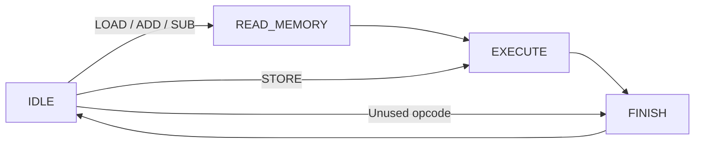

# Calculator project

[Start here](../README.md) · Document 5 of 10

*Beginner path. Edit only `rtl/calculator.sv` for this part.*

Your job is to finish the calculator's state transitions, memory-read register, and accumulator updates. The memory and instruction interface are already provided. The starting code is valid SystemVerilog, but it is intentionally incomplete; it will not pass the testbench yet.

## The provided memory

`rtl/data_memory.sv` contains 16 signed 8-bit locations. It starts with 8 at address 0, 3 at address 1, and zero everywhere else.

Reading is combinational: set `memory_address`, and the selected value appears on `memory_read_data`. Writing happens on a rising clock edge when `memory_write_enable` is 1; the memory copies `memory_write_data` into the selected address.

The `initial` block preloads this teaching memory for simulation. ASIC memories need a real initialization/loading plan; don't assume this preload creates an automatically initialized fabricated memory. Reset clears the calculator, not the memory. Restarting the simulation reloads the initial memory contents.

## Understand the signals

| Signal | Meaning |
| --- | --- |
| `instruction[7:0]` | Encoded command and address |
| `command_valid` | Testbench is presenting a command |
| `command_ready` | Calculator can accept a command |
| `command_done` | Current command has finished |
| `accumulator` | Stored working number |
| `memory_address` | Selected location, 0–15 |
| `memory_read_data` | Data from that location |
| `memory_write_data` | Data to write to that location |
| `memory_write_enable` | Allow a write on the next rising edge |

A command is accepted **on a rising edge when both `command_valid` and `command_ready` are 1**. While the calculator is busy, ready is 0. Keep the instruction stable until acceptance, then lower valid so it isn't accepted again later.

The provided interface handles the ready/done signals and saves the opcode and address. Read those blocks, but keep your changes in the TODOs.

## The four states

| State | What happens before the next rising edge | What happens on that edge |
| --- | --- | --- |
| `IDLE` | Advertise ready and examine the incoming command | Save the accepted opcode/address and leave idle |
| `READ_MEMORY` | Memory is showing the saved address's data | Capture it into `saved_memory_data` |
| `EXECUTE` | Select the saved opcode's operation | Update the accumulator, or let memory perform STORE |
| `FINISH` | Advertise done for one cycle | Return to idle |

For `LOAD 0`, edge 1 accepts the instruction, edge 2 captures the number 8, and edge 3 copies 8 into the accumulator. Done is high after edge 3; edge 4 returns the calculator to idle. `STORE` skips the read, so its write happens at edge 2 instead.

## Finish the TODOs

1. **State transitions.** Use the diagram to finish the `case` statement in the first `always_comb`. Stay idle without a command. Reading operations go to `READ_MEMORY`; STORE goes straight to `EXECUTE`; unused opcodes go to `FINISH`.
2. **Capture the memory value.** In the clocked block, when the current state is `READ_MEMORY`, save `memory_read_data` into `saved_memory_data`. This is a register update, so use `<=`.
3. **Accumulator operations.** In `EXECUTE`, use the saved opcode. LOAD copies the saved memory value, ADD adds it to the accumulator, and SUB subtracts it. STORE keeps the accumulator unchanged; the provided memory-write logic handles the write.

Start by implementing LOAD and following it through the waveform. Then add ADD and SUB. Finally check that STORE and the return to idle work. The full provided test needs all four operations, so intermediate failures are expected.

Leave the reset, module ports, and supplied interface logic in place. Don't add parameters, local parameters, helper functions, or tasks. The provided `enum` just gives readable names to the four states.

A [completed reference solution](../solutions/calculator_solutions.sv) is available if you need to compare your work. Try the project yourself first. To simulate the solution, use it instead of the starter; never add both calculator files to the same project.

---

[← Previous: ISA refresher](04-isa-refresher.md) · [Start here](../README.md) · [Next: Simulation and testbenches →](06-simulation-testbenches.md)
