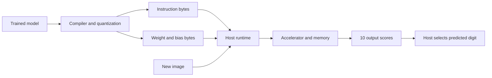

# Accelerator full stack

[Start here](../README.md) · Document 9 of 10

*Everyone. Keep the same 784 → 128 → 10 example in mind.*



## Give every value a home

For this example, **a byte address identifies one byte**, and model data is stored in contiguous memory regions. A “weight matrix” is a useful logical shape; it can be laid out as a flat sequence of bytes.

| Region | Shape / type | Data size | What it holds |
| --- | --- | --- | --- |
| Input activations | 784 × INT8 | 784 bytes | Converted pixels for the current image |
| First-layer weights, W1 | 128 × 784 × INT8 | 100,352 bytes | One row of 784 weights per hidden neuron |
| First-layer biases, b1 | 128 × INT32 | 512 bytes | One wide bias per hidden neuron |
| Hidden activations | 128 × INT8 | 128 bytes | ReLU and requantized first-layer results |
| Second-layer weights, W2 | 10 × 128 × INT8 | 1,280 bytes | One row of 128 weights per output neuron |
| Second-layer biases, b2 | 10 × INT32 | 40 bytes | One wide bias per output neuron |
| Output scores | 10 × INT32 | 40 bytes | The ten digit scores |
| Accumulator scratch space | Up to 128 × INT32 in this example | 512 bytes | Wide partial/finished sums before requantization |
| Instruction region | Encoded commands | Depends on encoding/program length | Which operations to execute and where |

The raw image also takes 784 unsigned bytes on the host before conversion. It is not an extra 784 required on-chip registers.

Here is an **illustrative system-memory map**, chosen to make the addresses concrete:

| Region | Start byte address | Last byte address |
| --- | --- | --- |
| Reserved instruction space (1,024 bytes) | `0x00000` | `0x003FF` |
| Input activations | `0x01000` | `0x0130F` |
| W1 | `0x02000` | `0x1A7FF` |
| b1 | `0x1A800` | `0x1A9FF` |
| Hidden activations | `0x1AA00` | `0x1AA7F` |
| W2 | `0x1AB00` | `0x1AFFF` |
| b2 | `0x1B000` | `0x1B027` |
| Output scores | `0x1B100` | `0x1B127` |
| Accumulator scratch space | `0x1B200` | `0x1B3FF` |

For example, input pixel 1 lives at `0x01001`. With W1 stored row by row, `W1[j][i]` lives at `0x02000 + j×784 + i`. Bias `b1[j]` begins at `0x1A800 + j×4` because each bias takes four bytes.

These are separate **regions**, not necessarily separate physical memory chips. Much of the data may live in external memory and move through small on-chip buffers. We are not claiming all these bytes fit inside one Tiny Tapeout tile. The instruction reservation and addresses are teaching choices, not the final accelerator specification.

## What the compiler does

The compiler reads the model's operations and parameters, checks which operations our hardware supports, chooses numeric formats, and creates an executable plan.

For our example it recognizes “Linear → ReLU → Linear,” lays out W1/b1/W2/b2, converts parameters into integer bytes, and generates instructions to move data and run those operations. It might break a large matrix operation into smaller **tiles** that fit the chip's buffers.

An **assembler** turns instruction names and operands into the binary encoding that hardware decodes. The compiler decides which operations are needed; the assembler encodes them. These can be stages of the same software tool.

The compiler doesn't send Python source to the chip. It produces instruction bytes, parameter bytes, and metadata such as addresses, shapes, and scaling values. Supporting a particular PyTorch model requires supporting its operations; it doesn't automatically mean every PyTorch model will run.

## A bigger ISA for the accelerator

The onboarding calculator's byte-sized ISA only supports a 4-bit address and four scalar operations. It cannot encode this larger memory map or a whole matrix operation. An accelerator ISA needs wider or additional fields for addresses, buffer selection, dimensions, and scaling.

Use this **illustrative assembly** to understand the plan; it is not code to run in the calculator:

```text
LOAD     input_region → A_buffer
LOAD     W1_region    → W_buffer
LOAD     b1_region    → B_buffer
MATMUL   A_buffer, W_buffer → ACC
ADD_BIAS B_buffer → ACC
RELU     ACC → ACC
RESCALE  ACC → H_buffer
STORE    H_buffer → hidden_region

LOAD     hidden_region → A_buffer
LOAD     W2_region     → W_buffer
LOAD     b2_region     → B_buffer
MATMUL   A_buffer, W_buffer → ACC
ADD_BIAS B_buffer → ACC
STORE    ACC → output_region
HALT
```

`RESCALE` converts the wide results into INT8 values in a small hidden-output buffer, `H_buffer`; STORE writes those values to system memory. A real ISA could combine conversion with ReLU or STORE. Likewise, the large LOADs above represent logical transfers: a small implementation repeats transfers and computation in chunks. They do not move 100,352 weights in one clock.

The memory directions are:

```text
System / external memory ──LOAD──> on-chip A, W, and B buffers
A and W buffers ──multiply/add──> wide ACC registers or scratch space
B buffer ──add bias──> ACC
ACC ──ReLU + rescale──> H buffer ──STORE──> hidden activation region
ACC ──STORE──> output region in system / external memory
```

The calculator's LOAD copies one memory value into one accumulator. The accelerator example uses LOAD to move a block into a buffer. The shared idea is explicit data movement; their exact ISA definitions differ.

## What the runtime does

The **host** is the computer or controller connected to the accelerator. Its **runtime** is the software that loads compiled instructions and parameters, prepares each input image, starts execution, waits for completion, and reads the results.

Before execution, model parameters and instructions are loaded into their assigned regions. For each new image, the runtime writes new input activations. During execution, hardware reads the prepared instructions/data and writes intermediate values and scores. The runtime finally reads the ten scores and selects the largest.

For example, the weights are reused for a photo of a 7 and a photo of a 2. The input bytes, hidden activations, and output scores change. Training or loading a different model changes the weights.

## Follow one neuron through the chip

Suppose we're computing hidden neuron 0:

1. Clear its 32-bit accumulator.
2. Read input activation 0 and weight `W1[0][0]` into small local storage.
3. Multiply and add the product to the accumulator.
4. Repeat for inputs 1–783.
5. Add `b1[0]`.
6. Apply ReLU, rescale, and store the INT8 result at hidden location 0.

That repeated “multiply, then accumulate” is a **MAC** operation. The earlier numeric example—0, then 254, then 190, then bias producing 195—is the same process on three inputs.

Repeat for all 128 hidden neurons. Then compute the ten second-layer neurons using the hidden activations. A serial implementation reuses one multiplier for many cycles; a parallel implementation uses several multipliers to work on multiple products at once. More arithmetic helps only if memory can supply data fast enough.

The two layers need `128×784 + 10×128 = 101,632` multiplications per image, before counting bias, rescaling, or control work. That is an operation count—not a promise of a particular clock rate or latency.

## Verify the same example at every level

| Check | What runs | What should agree |
| --- | --- | --- |
| Floating-point model | Original trained software model | Baseline predictions/accuracy |
| Quantized reference | Integer arithmetic with specified rounding, saturation, and overflow | Accuracy is evaluated against the original model |
| ISA simulator | Software interpreting the compiled instructions | Exact integer intermediate/final values against the quantized reference |
| RTL simulation | SystemVerilog in QuestaSim/ModelSim | Values, instruction behavior, handshakes, reset, and timing |
| FPGA prototype | Actual configured hardware | Same test inputs give the expected outputs on the board |
| Fabricated ASIC | Manufactured circuitry | Bring-up checks the real device; manufacturing tests screen defects |

If software predicts 7 but RTL predicts 2, compare intermediate results. Did input location 1 contain the right pixel? Did the first multiply use the right weight? Was a signed byte interpreted as unsigned? A small reference example lets us locate the first disagreement.

## One small ISA exercise

Using the illustrative accelerator commands, write a short sequence that:

1. Loads an input vector and weights.
2. Computes a weighted sum.
3. Adds a bias.
4. Applies ReLU and rescales the result.
5. Stores the result.

Label which steps read memory, which perform arithmetic, and which write memory. Then explain why STORE before MATMUL would save the wrong value. This is a reading/writing exercise, not a Python assignment.

An LLM uses a more complicated model: token inputs, attention, multiple layers, and additional memory such as a KV cache for previous tokens. The same model → compiler → ISA → hardware relationship still applies. That's the connection to our later project; you don't need to learn an entire transformer architecture for onboarding.

---

[← Previous: AI inference fundamentals](08-ai-inference-fundamentals.md) · [Start here](../README.md) · [Next: Submission →](10-submission.md)
